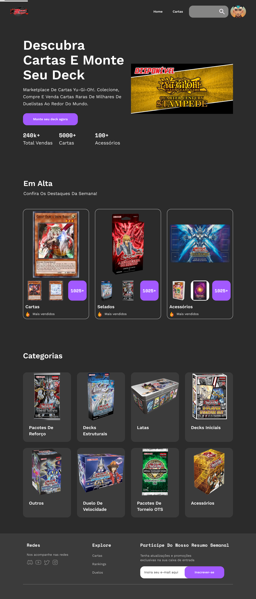
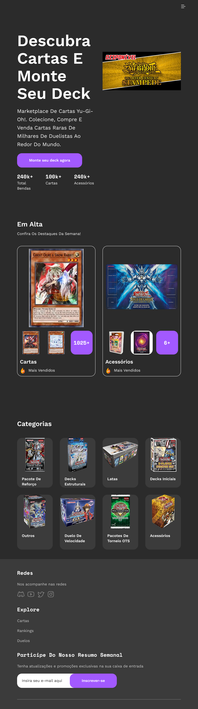
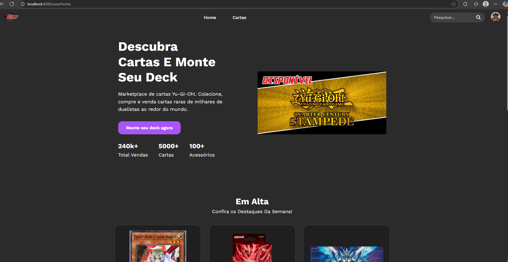
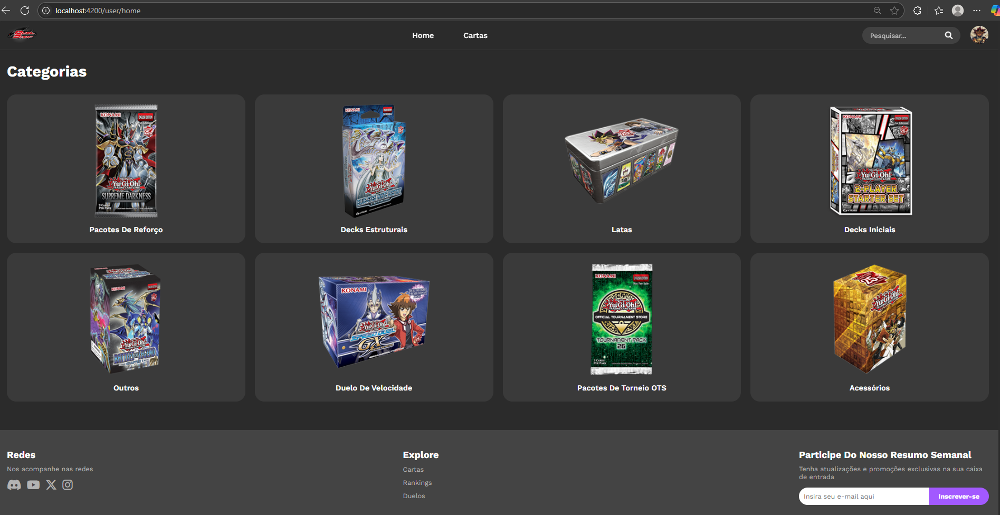
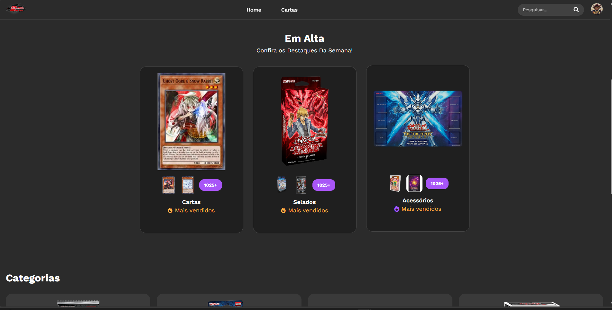
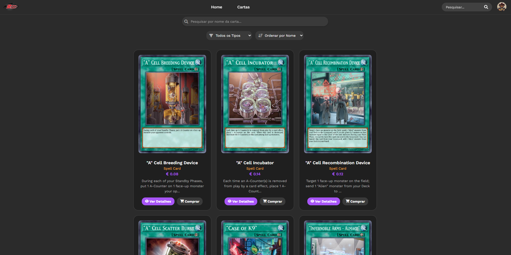
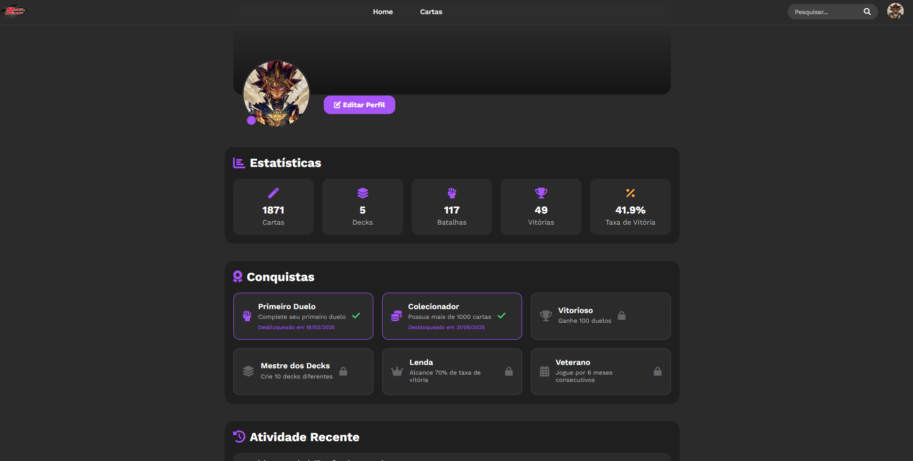
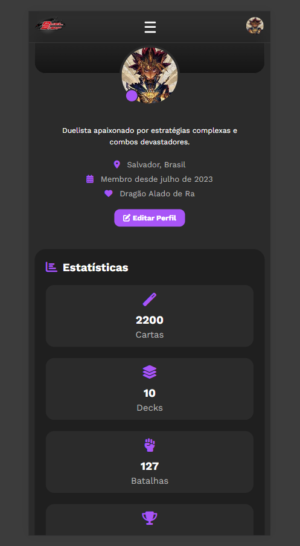

# IHC-FRONTEND

Este é um projeto de frontend desenvolvido em Angular para a disciplina de Interação Humano-Computador (IHC) na faculdade. O sistema simula uma plataforma de cartas colecionáveis, com funcionalidades de autenticação, visualização de cartas e estatísticas do usuário.

## Tecnologias Utilizadas

- **Frontend:** Angular, TypeScript, CSS
- **Backend:** Spring Boot (Java), autenticação JWT
- **Outros:** RxJS, Angular Forms, consumo de API externa (YGOPRODeck)

## Prints do Figma

Protótipo desenvolvido no Figma:




## Prints do Site Pronto

### Header e Home




### Página de Cartas



### Perfil do Usuário



### Home Responsivo


## Como clonar o projeto

1. Abra o terminal ou prompt de comando.
2. Execute o comando abaixo para clonar o repositório do frontend:

```bash
git clone https://github.com/EvertonFarias/IHC-FRONTEND.git
```

3. Acesse a pasta do projeto:
```bash
cd IHC-FRONTEND
```

4. Instale as dependências:
```bash
npm install
```

5. Inicie o projeto:
```bash
npx ng serve
```

## Funcionalidades

- **Login:** Permite que o usuário acesse a plataforma com seu login ou e-mail e senha.
- **Registro:** Possibilita criar uma nova conta na plataforma. É necessário confirmar o e-mail para ter acesso a todas as funcionalidades do site.
- **Recuperar senha:** Caso o usuário esqueça a senha, pode solicitar a redefinição. 
- **Home:** Página inicial com informações gerais e navegação.
- **Página do usuário:** Exibe dados fictícios do usuário, incluindo estatísticas e informações de perfil.
- **Página de cartas:** Mostra uma lista de cartas colecionáveis, com as seguintes funcionalidades:
  - **Busca por nome da carta:** Campo de pesquisa específico na página de cartas para filtrar cartas pelo nome.
  - **Filtro por tipo de carta:** Permite selecionar o tipo de carta (Ex: Monstro, Magia, Armadilha, etc).
  - **Ordenação:** Opção para ordenar as cartas por nome ou preço.
  - **Paginação:** Navegação entre páginas de cartas.
  - **Visualização de detalhes:** Botão para ver detalhes de cada carta.

> **Importante:** O campo de busca e os filtros funcionam apenas na página de cartas, não no campo de pesquisa do cabeçalho.

## Usuários de exemplo

O backend já possui um usuário criado pelo seeder para facilitar os testes:

- **login:** admin
- **senha:** admin12345

## Observações
- Em caso de criação de um novo usuário, verificar se o e-mail chegou no spam.
- O projeto utiliza dados fictícios para a área do usuário e estatísticas.
- As imagens e informações das cartas são obtidas da API pública [YGOPRODeck](https://db.ygoprodeck.com/api-guide/).
- **Limite da API:** A YGOPRODeck permite até 20 requisições por minuto por IP. Caso esse limite seja excedido, novas requisições podem ser temporariamente bloqueadas.
- O layout é responsivo e adaptado para dispositivos móveis.

## Autores

- WESLLY VITOR GOMES ROCHA SILVA
- EVERTON DE FARIAS RIBEIRO
- MARCUS CEZAR MOREIRA FERRAZ
- PEDRO VINÍCIUS DE LIMA JATOBÁ

---

Projeto acadêmico desenvolvido para fins de estudo e demonstração de conceitos de IHC.
